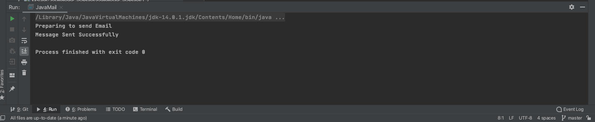

<h2> Sending Email using Java Automation: Gmail Server </h2>


Platform supporting Maven: [IntelliJ IDEA CE](https://www.jetbrains.com/idea/download/download-thanks.html?platform=mac&code=IIC)

1. Create a new Project

2. Choose [Maven](https://en.wikipedia.org/wiki/Apache_Maven#:~:text=Maven%20is%20a%20build%20automation,%2C%20Scala%2C%20and%20other%20languages.&text=Maven%20is%20built%20using%20a,application%20controllable%20through%20standard%20input.)

3. In Project SDK box, make sure you have latest version of java "JDK"

<p align="center">
	
</p>

4. Click Next, and give a name to your project, like "JavaMail"

5. Now create a package inside src/test/java/ and name it "sendMail" then create a class inside it, name it "JavaMailTest", and we also need to create a main class, name it "JavaMail"


<h4> What is Maven? </h4>

"Maven is a build automation tool used primarily for Java projects. Maven can also be used to build and manage projects written in C#, Ruby, Scala, and other languages.

Maven addresses two aspects of building software: how software is built, and its dependencies. An XML file describes the software project being built, its dependencies on other external modules and components, the build order, directories, and required plug-ins. It comes with pre-defined targets for performing certain well-defined tasks such as compilation of code and its packaging. 

Maven dynamically downloads Java libraries and Maven plug-ins from one or more repositories such as the Maven 2 Central Repository, and stores them in a local cache. Maven projects are configured using a Project Object Model, which is stored in a [pom.xml](https://github.com/kk289/Java-sendEmail-using-Gmail-Server/blob/master/pom.xml) file."

An example of [pom.xml](https://github.com/kk289/Java-sendEmail-using-Gmail-Server/blob/master/pom.xml) file looks like: 

```
<?xml version="1.0" encoding="UTF-8"?>
<project xmlns="http://maven.apache.org/POM/4.0.0"
         xmlns:xsi="http://www.w3.org/2001/XMLSchema-instance"
         xsi:schemaLocation="http://maven.apache.org/POM/4.0.0 http://maven.apache.org/xsd/maven-4.0.0.xsd">
    <modelVersion>4.0.0</modelVersion>

    <groupId>org.example</groupId>
    <artifactId>OpenBrowser</artifactId>
    <version>1.0-SNAPSHOT</version>

    <properties>
        <project.build.sourceEncoding>UTF-8</project.build.sourceEncoding>
        <maven.compiler.source>1.7</maven.compiler.source>
        <maven.compiler.target>1.7</maven.compiler.target>
    </properties>

    <dependencies>

         <!-- https://mvnrepository.com/artifact/javax.mail -->
        <dependency>
            <groupId>javax.mail</groupId>
            <artifactId>mail</artifactId>
            <version>1.5.0-b01</version>
            <scope>test</scope>
        </dependency>

    </dependencies>

</project>
```

9. Make sure to setup your "pom.xml" file like above. Just replace your pom.xml file with this [pom.xml](https://github.com/kk289/Java-sendEmail-using-Gmail-Server/blob/master/pom.xml)

## JavaMailTest

Let's look at "JavaMailTest" class:

```
package sendMail;

import javax.mail.Session;
import javax.mail.Transport;
import java.util.Properties;
import java.util.logging.Level;
import java.util.logging.Logger;
import javax.mail.*;
import javax.mail.internet.InternetAddress;
import javax.mail.internet.MimeMessage;

public class JavaMailTest {

    public static void sendMail(String recipient) throws Exception {

        System.out.println("Preparing to send Email");

        final String myAccountEmail = "example@gmail.com"; // Enter your gmail (sender)
        final String password = "*******"; // Enter your gmail password

        // Get the session object
        Properties properties = new Properties();
        properties.put("mail.smtp.auth", "true");
        properties.put("mail.smtp.starttls.enable", "true");
        properties.put("mail.smtp.host", "smtp.gmail.com");
        properties.put("mail.smtp.port", "587");

        Session session = Session.getInstance(properties, new Authenticator() {
            @Override
            protected PasswordAuthentication getPasswordAuthentication() {
                return new PasswordAuthentication(myAccountEmail, password);
            }
        });

        // recall Message
        Message message = prepareMessage(session, myAccountEmail, recipient);

        // Send message
        Transport.send(message);
        System.out.println("Message Sent Successfully");
    }

    // Compose the message
    private static Message prepareMessage(Session session, String myAccountEmail, String recipient) {

        try {
            Message message = new MimeMessage(session);
            message.setFrom(new InternetAddress(myAccountEmail));
            message.setRecipient(Message.RecipientType.TO, new InternetAddress(recipient));
            message.setSubject("My First Email from Java App");
            message.setText("Hello World, \nExample of sending email in Java through SMTP server provided by the host provider.");
            return message;

        } catch (Exception ex) {
            Logger.getLogger(JavaMailTest.class.getName()).log(Level.SEVERE, null, ex);
        }
        return null;
    }
}
```

Now we need main file to run this program. Go to JavaMail class.

## JavaMail

```
package sendMail;

public class JavaMail {
    public static void main(String[] args) throws Exception{
        JavaMailTest.sendMail("example@gmail.com"); // enter gmail: receiver
    }
}
```

Let's run the "JavaMail" class. We get following result: 


<p align="center">
	
	<br>
	<br>
	
</p>

The program run successfully. Make sure you check the inbox whether receiver got any email or not.

<b>Thank you. Let me know if you have any questions.</b>

